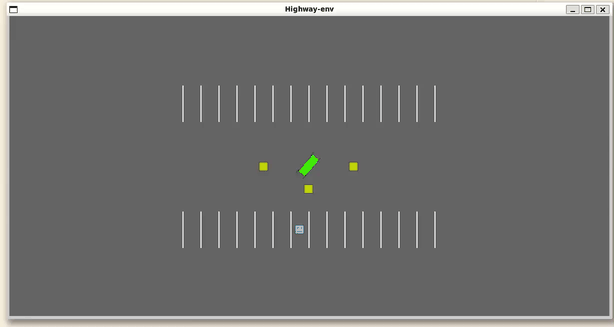

# rl-parking-problem

## Introduction
This project aims to solve the parking problem automatically using reinforcement learning.

## Definition

### Environment
The environment consists of a car that needs to find a parking spot within a parking lot while avoiding collisions with obstacles.

- **30 parking spaces** (1 available)
- **3 fixed obstacles**
- **1 car**

### State Space
- The **observation** is the same as the **achieved goal**.  
- The **desired goal** is the position of the parking space.

### Action Space
- **Steering range:** \(-0.5\) to \(0.5\)  
- **Acceleration range:** \(-0.4\) to \(0.4\)  

To convert continuous actions into discrete actions

|   | **Steering (m)** | **Acceleration (n)** |
|---|------------------|----------------------|
| 1 | 11              | 4                    |

### Reward Function
- **Collision penalty:** \(-5\)  
- **Distance-based reward:**   
The reward is determined by the distance to the target  

$$ R = -(|a - d| * w)^P $$

### Neural Network
* Policy Net
* Target Net

```python
class DeepQNetwork(nn.Module):
    def __init__(self, n_observations,n_actions):
        super(DeepQNetwork, self).__init__()
        self.layer1 = nn.Linear(n_observations, 128)
        self.layer2 = nn.Linear(128, 64)
        self.layer3 = nn.Linear(64, 32)
        self.layer4 = nn.Linear(32, n_actions)

    def forward(self, x):
        # Ensure batch dimension remains unchanged, flatten the other dimensions
        x = x.view(x.size(0), -1)  
        x = F.relu(self.layer1(x))
        x = F.relu(self.layer2(x))
        x = F.relu(self.layer3(x))
        return self.layer4(x)
```

## Convergence Plot


### Result

